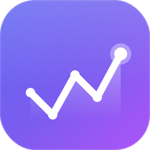
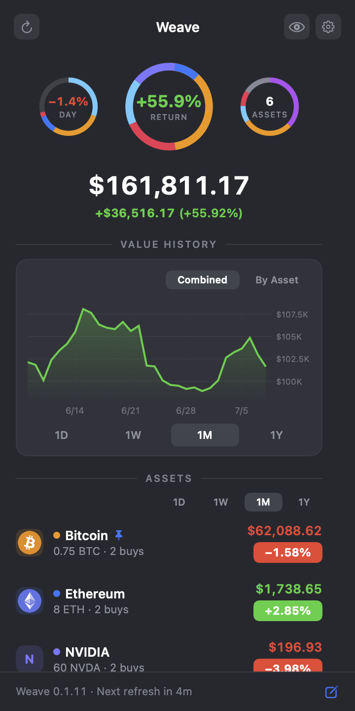
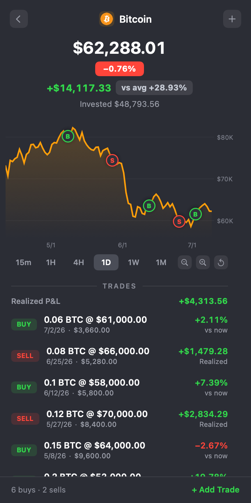
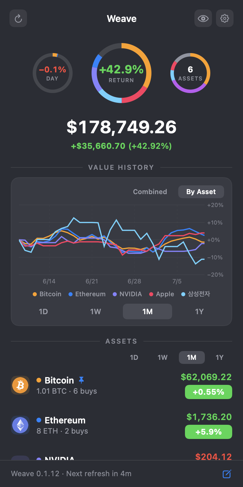

<div align="center">



# Weave

**한국·미국·일본 주식과 크립토를 macOS 메뉴바에서. 계정 없이 로컬 저장, 내 거래 기반 실제 손익까지.**

[](https://github.com/kang1027/Weave/releases)
[](LICENSE)
[](https://www.apple.com/macos)
[](https://swift.org)

[English](README.md) · **한국어**

<br>

<br>
<sub>메뉴바에 상주</sub>

<br><br>

<table align="center">
  <tr>
    <td align="center"><br><sub><b>포트폴리오</b></sub></td>
    <td align="center"><br><sub><b>종목 세부</b></sub></td>
    <td align="center"><br><sub><b>자산별</b></sub></td>
  </tr>
</table>

</div>

## 기능

- **메뉴바에 상주합니다.** 보유 자산 시세를 번갈아 보여주고, 클릭하면 팝오버로 펼쳐집니다.
- **한국·미국·일본 주식 + 크립토.** Binance·Naver·Yahoo Finance 심볼 검색을 한곳에서 지원합니다.
- **정확한 평단·손익.** 매수/매도 기록을 바탕으로 평단과 미실현·실현 수익률을 계산합니다.
- **가치 히스토리 차트.** 통합·자산별(1D / 1W / 1M / 1Y) 차트에 링 게이지와 매수 마커까지 보여줍니다.
- **수동 자산.** 티커가 없는 자산도 추적할 수 있어 부동산·현금 등 원하는 것은 무엇이든 합산됩니다.
- **프라이버시 모드.** 금액은 가리고 등락률은 유지하며, 팝오버와 메뉴바에 동시에 적용됩니다.
- **온전히 로컬.** 계정도 텔레메트리도 없이 데이터가 이 Mac을 벗어나지 않습니다. `.weave` 백업은 커스텀 로고까지 담는 자기완결형입니다.
- **네이티브하고 깔끔합니다.** Slate / Light 테마와 한국어 / English를 지원하고, 서명·공증을 마쳤으며 Sparkle로 자동 업데이트됩니다.

## 설치

### Homebrew (권장)

```sh
brew install --cask kang1027/weave/weave-pt
```

한 줄이면 tap과 설치가 한 번에 끝납니다. Developer ID로 서명하고 Apple 공증을 마쳐 Gatekeeper 경고 없이 실행되며, Sparkle로 자동 업데이트됩니다. 업데이트는 `brew upgrade --cask weave-pt` 로 하시면 됩니다.

### 직접 다운로드

Homebrew를 쓰지 않으신다면 [releases](https://github.com/kang1027/Weave/releases/latest)에서 최신 `.dmg`를 받아 연 뒤 **Weave**를 Applications 폴더로 드래그하세요. 서명·공증되어 있어 Gatekeeper 경고가 뜨지 않습니다.

### 소스 빌드

macOS 14 이상과 Swift 툴체인이 필요합니다.

```sh
git clone https://github.com/kang1027/Weave.git
cd Weave
scripts/fetch-sparkle.sh   # 최초 1회 — Sparkle 벤더링
swift run Weave            # 개발 실행
swift test                 # 단위 테스트
scripts/bundle.sh          # dist/Weave.app 번들 생성
```

## 데이터 · 프라이버시

포트폴리오는 이 Mac 로컬(`Application Support/Weave`)에만 저장되며 외부로 전송되지 않습니다. Binance·Naver·Yahoo Finance의 공개 시세·캔들만 조회하고, 계정·API 키·텔레메트리는 전혀 없습니다. 자세한 내용은 [PRIVACY.md](PRIVACY.md)·[SECURITY.md](SECURITY.md)에 있습니다.

시세 데이터는 비공식 공개 엔드포인트에서 오며 지연되거나 부정확할 수 있습니다. Weave는 개인용 기록 도구이지 투자 조언이 아닙니다.

## 후원

Weave는 무료 오픈소스입니다. 개발을 후원하고 싶으시면 Mac App Store에서 유료 빌드로도 받으실 수 있습니다. 같은 앱이며, 그저 마음을 보태는 용도입니다.

## 문서

[기능 명세](docs/FEATURES.ko.md) · [동작 플로우](docs/FLOWS.ko.md) · [Privacy](PRIVACY.md) · [Security](SECURITY.md) · [Contributing](CONTRIBUTING.md)

## 라이선스

[MIT](LICENSE) © 2026 kang1027
